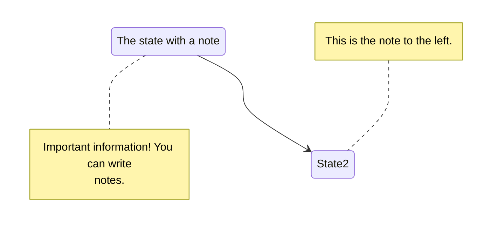

---
# ============================================
# Hugo Book - Front Matter 완전 템플릿
# ============================================

# --- 기본 필수 필드 ---
title: "hidden template"
date: 2026-01-08T13:22:00+09:00
draft: false

# --- 콘텐츠 구성 ---
weight: 10                            # 메뉴 순서 (낮을수록 먼저)
description: "페이지 설명 (SEO)"
summary: "목록에 표시될 요약"
keywords: ["키워드1", "키워드2"]

# --- 분류 ---
categories: ["카테고리"]
tags: ["태그1", "태그2"]
aliases:                              # URL 리다이렉션
  - /old-url/

# --- 날짜 관리 ---
publishDate: 2000-01-01               # 미래 날짜로 예약 게시
lastmod: 2026-01-08                   # 마지막 수정일
# expiryDate: 2027-01-08                # 만료일

# --- 외관/레이아웃 ---
type: "docs"
layout: "single"

# --- Hugo Book 전용 ---
bookHidden: true                      # 메뉴에서 숨김 (이 템플릿용)
bookToC: true                         # 목차 표시
bookFlatSection: false                # 섹션 평평하게 표시
bookCollapseSection: false            # 접힌 상태로 표시
bookComments: false                   # 댓글 활성화
bookSearchExclude: true               # 검색에서 제외

# --- 커스텀 파라미터 ---
params:
  author: "작성자명"
  featured: true
  custom_field: "원하는 값"

# --- 메뉴 커스터마이징 ---
menu:
  main:
    weight: 10
    parent: "부모메뉴"
---

# Hugo Book 기능 모음

## Buttons

Get Home
hugo-book

---

## Columns

{}

- ### Left Content

  Lorem markdownum insigne...

- ### Mid Content

  Lorem markdownum insigne...

- ### Right Content

  Lorem markdownum insigne...

{}

---

## Detail

{}

## Markdown content

Lorem markdownum insigne...
{}

---

## Hint

> [!NOTE]
> **Markdown content**  
> Lorem markdownum insigne. Olympo signis Delphis! Retexi Nereius nova develat
> stringit, frustra Saturnius uteroque inter! Oculis non ritibus Telethusa

> [!TIP]
> **Markdown content**  
> Lorem markdownum insigne. Olympo signis Delphis! Retexi Nereius nova develat
> stringit, frustra Saturnius uteroque inter! Oculis non ritibus Telethusa

> [!IMPORTANT]
> **Markdown content**  
> Lorem markdownum insigne. Olympo signis Delphis! Retexi Nereius nova develat
> stringit, frustra Saturnius uteroque inter! Oculis non ritibus Telethusa

> [!WARNING]
> **Markdown content**  
> Lorem markdownum insigne. Olympo signis Delphis! Retexi Nereius nova develat
> stringit, frustra Saturnius uteroque inter! Oculis non ritibus Telethusa

> [!CAUTION]
> **Markdown content**  
> Lorem markdownum insigne. Olympo signis Delphis! Retexi Nereius nova develat
> stringit, frustra Saturnius uteroque inter! Oculis non ritibus Telethusa

---

## Mermaid



---

## Steps

{}

1. ## Suspendisse sed congue orci.
   ...

2. ## Maecenas scelerisque sem.
   ...

3. ## Etiam risus purus.
   ...

4. ## Curabitur sed lacinia velit.
   ...

{}

---

## Tabs


{} # MacOS Content {}
{} # Linux Content {}
{} # Windows Content {}


---

## KaTex

```katex
f(x) = \int_{-\infty}^\infty\hat f(\xi)\,e^{2 \pi i \xi x}\,d\xi
```